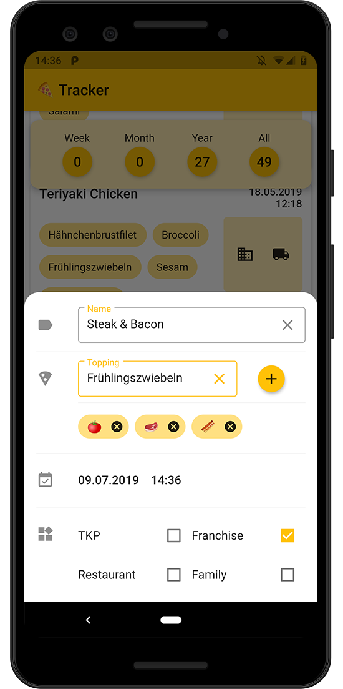

# Pizza Tracker
🍕🍕🍕🍕🍕🍕🍕🍕  

This (Android)-App collects Data about my Pizza Eating Habits. It's mostly inspired
by some Threads at [r/dataisbeautiful/](https://www.reddit.com/r/dataisbeautiful/) 
and their more often than not odd Datasets. It is written in Dart with the [Flutter](https://flutter.dev/docs)-Framework.  
It belongs to a university project at the University of Applied Sciences Jena which I developed for an elective module called "Mobile App Development II".

Since this is my first project with Flutter, it's probably full of ugly hacks and things that could have been done better.
However done is better than perfect. This app is a classic CRUD (well w/o the Update Part) Application that reads and writes data to the Cloud NoSQL database "Firestore". It has three main widgets: a list to display eaten pizzas, an info panel about the number of pizzas eaten, and a form to collect data.

App-Overview                           |  Data-Form
:-------------------------------------:|:----------------------------------------:
|  

At the present time the following data can be collected:
- Name of the Pizza
- Toppings
- Date & Time
- Type of the Pizza:
  - TKP (Frozen Pizza)
  - Franchise
  - Restaurant
  - Family-Size
  - Delivery
  - Selfmade
- Place 

The ```google-services.json``` file that contains my Firestore-Configuration is missing in this Development-Branch and other References have been renamed.
